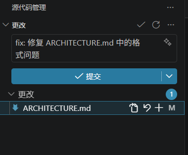
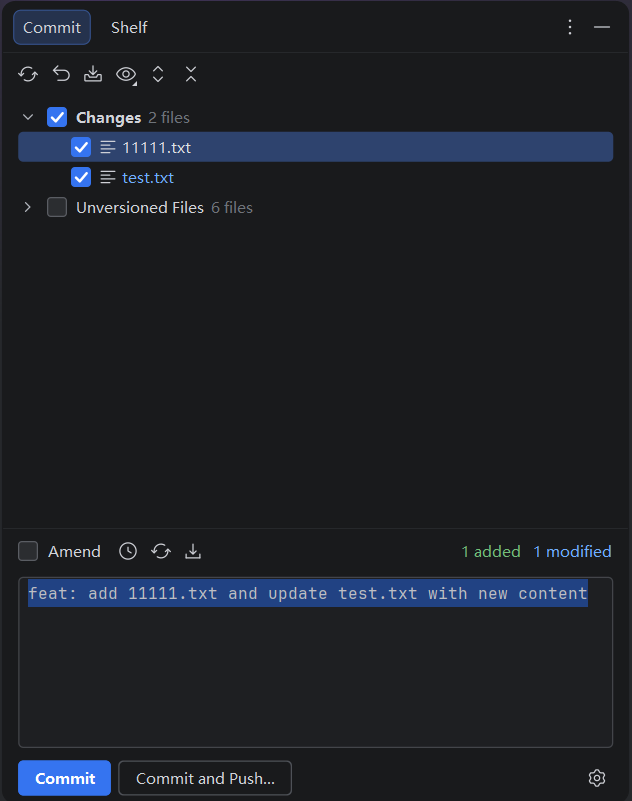

# commit-rag

> 基于 RAG（检索增强生成）的 AI commit message 生成器——**学习你仓库自己的 commit 历史风格**，生成符合项目规范的消息。

[](https://code.visualstudio.com/)
[](https://www.jetbrains.com/idea/)
[](https://nodejs.org/)
[](https://www.typescriptlang.org/)
[](https://kotlinlang.org/)

直接让 LLM 写 commit message 只能得到**通用的** Conventional Commits 格式。commit-rag 会先索引你仓库的 commit 历史，用向量检索找到与当前改动最相似的历史 commit，作为 few-shot 示例喂给 LLM——这样生成的消息**遵循你自己项目的约定**，而不是通用规范。

---

## 效果展示

| VS Code | IntelliJ IDEA |
|---------|---------------|
|  |  |

---

## 为什么用 RAG？

把 `git diff` 直接丢给 LLM，它会按训练数据里的规范写——它不知道你的项目用 `feat(core):` 还是 `feature:`，用中文还是英文，type 命名有什么习惯。

**commit-rag** 用 RAG 解决这个问题：

1. **索引阶段**：遍历最近 200 条 commit，用 Qwen 模型把每条 diff 向量化，存入本地 `.commit-rag/index.json`
2. **生成阶段**：你 `git add` 之后，把暂存区 diff 向量化 → 检索最相似的 5 条历史 commit → 拼进 prompt 作为示例 → DeepSeek 生成

LLM 看到的是"这个项目实际上怎么写 commit 的"，不是"标准规范上应该怎么写"。

---

## 架构

```
┌──────────────────────────────────┐
│       @commit-rag/core           │  ← IDE 无关核心引擎 (TypeScript)
│  git · diff · embedding · index  │
│  retrieve · prompt · llm · config│
│  cli.ts (CLI 入口)               │
└────────────┬─────────────────────┘
             │
   ┌─────────┴─────────┐
   ▼                   ▼
┌──────────────┐  ┌──────────────────┐
│ VS Code      │  │ IntelliJ / IDE   │
│ Extension    │  │ Plugin (Kotlin)  │
│ (Phase 1)    │  │ (Phase 2)        │
│              │  │                  │
│ import core  │  │ ProcessBuilder   │
│ 作为库调用   │  │ → CLI 子进程     │
└──────────────┘  └──────────────────┘
```

核心引擎与 IDE 解耦——VS Code 插件直接 import 它作为 npm 包，JetBrains 插件通过 CLI 子进程调用。同一个引擎也可以用于 GitHub Action 或独立命令行工具。

详见 [`ARCHITECTURE.md`](./ARCHITECTURE.md) 获取完整架构决策记录。

---

## 快速开始

### 环境要求

- [Node.js](https://nodejs.org/) ≥ 18
- [pnpm](https://pnpm.io/) ≥ 8
- [DeepSeek API key](https://platform.deepseek.com/api_keys)（LLM 生成）
- [阿里云 DashScope API key](https://dashscope.console.aliyun.com/apiKey)（Qwen embedding）

### 安装 & 构建

```bash
git clone https://github.com/Cup-fish/commit-rag.git
cd commit-rag
pnpm install
pnpm build
```

### VS Code 插件

1. 用 VS Code 打开 `packages/vscode-extension`
2. 按 **F5** → Extension Development Host
3. 打开任意 git 仓库
4. `git add` 暂存改动
5. 点击 SCM 标题栏的 ✨ 按钮
6. 检查生成的消息 → 点击 **Commit**

打包分发：

```bash
cd packages/vscode-extension
pnpm package    # 生成 commit-rag-vscode-0.0.0.vsix
```

### JetBrains 插件 (IntelliJ IDEA / WebStorm / Android Studio / ...)

**安装**：

1. 构建插件：
```bash
cd packages/intellij-plugin
./gradlew buildPlugin    # 生成 build/distributions/commit-rag-intellij-plugin-0.1.0.zip
```
2. IDE 中：Settings > Plugins > ⚙ > Install Plugin from Disk → 选择 zip 文件 → 重启

**首次使用**：

1. 打开任意 git 仓库
2. 打开 Commit 对话框（Ctrl+K / Cmd+K）
3. 如果未配置 API key，会弹出引导通知，点击 **Configure Keys** 进入 Settings > Tools > commit-rag 填写 key（存入 OS 密钥链，不会写入明文文件）
4. 点击 **Build RAG Index** 构建索引（每个仓库只需一次，VS Code 已构建过则可跳过）
5. `git add` 暂存改动 → 点击 **Generate Commit (RAG)**（快捷键 Ctrl+Alt+G）
6. 审阅生成的消息 → 提交

索引文件 `.commit-rag/index.json` **跨 IDE 共享**——VS Code 和 JetBrains 插件读写同一份文件。

### CLI / 核心库

```typescript
import {
  getStagedDiff, QwenEmbeddingProvider,
  buildIndex, saveIndex, loadIndex,
  retrieve, buildPrompt, generateCommitMessage,
} from "@commit-rag/core";

// 1. 构建 RAG 索引（每个仓库一次）
const embedder = new QwenEmbeddingProvider({ apiKey: "sk-..." });
const index = await buildIndex(embedder, config, { cwd: "/path/to/repo" });
saveIndex(index, "/path/to/repo");

// 2. 生成 commit message
const diff = await getStagedDiff({ cwd: "/path/to/repo" });
const [queryVec] = await embedder.embed([diff]);
const similar = retrieve(queryVec, index, 5);
const messages = buildPrompt(diff, similar);
const result = await generateCommitMessage(messages, { apiKey: "sk-..." });

console.log(result.message);
// → "feat(auth): add JWT middleware with role-based access control"
```

---

## 项目结构

```
commit-rag/
├── packages/
│   ├── core/                     # @commit-rag/core (TypeScript)
│   │   └── src/
│   │       ├── git.ts            # Git 接口 (execFile，防注入)
│   │       ├── embedding.ts      # EmbeddingProvider + Qwen/DashScope
│   │       ├── diff.ts           # 共享 diff 解析
│   │       ├── indexer.ts        # 索引流水线
│   │       ├── retrieve.ts       # 余弦相似度检索
│   │       ├── prompt.ts         # System + few-shot prompt 构造
│   │       ├── llm.ts            # DeepSeek API (OpenAI 兼容)
│   │       ├── config.ts         # 分层配置 (默认 → rc → env)
│   │       ├── cli.ts            # CLI 入口 (供 JetBrains 子进程调用)
│   │       └── index.ts          # Public barrel export
│   ├── vscode-extension/         # VS Code 插件 (Phase 1)
│   │   └── src/
│   │       └── extension.ts      # SCM 按钮、SecretStorage、进度提示
│   └── intellij-plugin/          # JetBrains 插件 (Phase 2)
│       └── src/main/kotlin/com/commitrag/intellij/
│           ├── GenerateCommitAction.kt   # VCS commit 面板按钮
│           ├── BuildIndexAction.kt       # 构建 RAG 索引
│           ├── CommitRagService.kt       # CLI 子进程 + JSON 解析
│           ├── CommitRagSettings.kt      # PasswordSafe + 设置界面
│           └── NodeStartupCheck.kt       # Node.js 启动检测
├── scripts/                      # 按天推进的冒烟测试
├── docs/
│   ├── design.md                 # 原始设计文档
│   ├── commit-rag-design-plan.md # 实施计划
│   └── progress.md               # 逐日开发日志
├── ARCHITECTURE.md               # 架构决策记录 (ADR)
├── README.en.md                  # English README
├── tsconfig.base.json
├── pnpm-workspace.yaml
└── package.json
```

---

## 配置

### API Key

API key **绝不**存储在明文文件中。加载优先级：

1. **环境变量**（最高优先级，所有客户端通用）：
   - `COMMIT_RAG_DASHSCOPE_API_KEY` — DashScope / Qwen embedding
   - `COMMIT_RAG_DEEPSEEK_API_KEY` — DeepSeek LLM
2. **VS Code SecretStorage**（VS Code 插件）— OS 密钥链
3. **IntelliJ PasswordSafe**（JetBrains 插件）— OS 密钥链
   （Settings > Tools > commit-rag 中填写）

### 语言偏好

设置 commit message 的语言：

```json
// .commitragrc.json
{
  "language": {
    "preferred": "zh"   // "auto" (默认) | "zh" (中文) | "en" (英文)
  }
}
```

或通过环境变量：`COMMIT_RAG_LANGUAGE=zh`

### 仓库配置

在仓库根目录创建 `.commitragrc.json`（所有字段可选）：

```json
{
  "indexing": {
    "maxCommits": 200,
    "maxDiffLines": 500
  },
  "retrieval": {
    "topK": 5
  },
  "model": {
    "embeddingModel": "text-embedding-v4",
    "embeddingDimensions": 1024,
    "llmModel": "deepseek-chat"
  },
  "language": {
    "preferred": "auto"
  }
}
```

---

## 开发

```bash
# TypeScript (core + VS Code 插件)
pnpm install          # 安装全部 workspace 依赖
pnpm build            # 构建全部 package
pnpm --filter @commit-rag/core build    # 只构建 core
pnpm --filter commit-rag-vscode build   # 只构建 VS Code 插件

# Kotlin (JetBrains 插件)
cd packages/intellij-plugin
./gradlew build       # 编译 + 测试
./gradlew test        # 只跑测试
./gradlew buildPlugin # 构建可分发的 .zip
./gradlew runIde      # 在 IntelliJ 沙箱中启动调试
```

运行冒烟测试：

```bash
# Day 1: git 接口
node scripts/smoke-test.mjs

# Day 2: embedding + index + retrieve
COMMIT_RAG_DASHSCOPE_API_KEY=sk-... node scripts/smoke-test-day2.mjs

# Day 3: prompt 构造 (无需 API key)
node scripts/smoke-test-day3.mjs

# Day 4: LLM + 错误处理
COMMIT_RAG_DEEPSEEK_API_KEY=sk-... node scripts/smoke-test-day4.mjs

# Day 5-6: 插件验证 + 全流程
COMMIT_RAG_DASHSCOPE_API_KEY=sk-... COMMIT_RAG_DEEPSEEK_API_KEY=sk-... \
  node scripts/smoke-test-day5.mjs

# Phase 2 Day 1: CLI 冒烟测试
node scripts/smoke-test-phase2-day1.mjs
```

---

## 技术栈

| 组件 | 技术 | 选型理由 |
|------|------|---------|
| Embedding | Qwen text-embedding-v4 (DashScope) | 100+ 语言、中文优化、¥0.0005/千 token、OpenAI 兼容 |
| LLM | DeepSeek (deepseek-chat) | 代码理解强、OpenAI 兼容、性价比高 |
| 向量检索 | 暴力余弦相似度 | < 1000 条目时 < 1ms，无需向量数据库 |
| VS Code 集成 | Extension API + Git API | 原生 SCM 按钮、SecretStorage、withProgress |
| JetBrains 集成 | IntelliJ Platform Plugin (Kotlin) | VCS commit 面板、PasswordSafe、ProcessBuilder |
| 构建 | pnpm workspace + Gradle | Monorepo (TS + Kotlin)、严格模式、ES2022 |

---

## License

MIT
